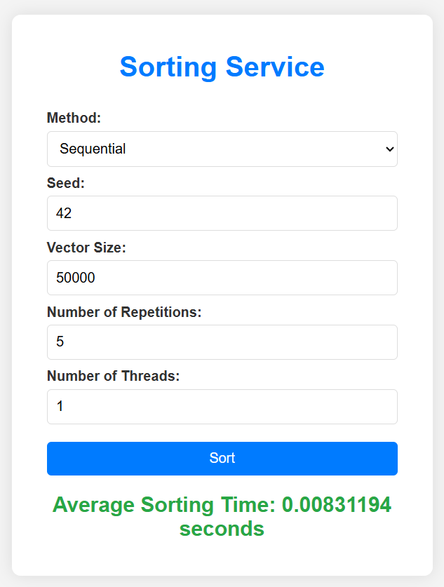

# Flask-WebApp


[](https://www.docker.com/)
[](https://www.python.org/downloads/release/python-3120/)

## Overview

This project contains a Flask-based web service designed to perform sorting on randomly generated vectors using either sequential or parallel methods. The service allows you to specify parameters such as the random seed, vector size, number of repetitions, and number of threads for parallel processing. The average execution time for the sorting operation is returned as a result.

## Features

- **Sequential and Parallel Sorting**: Choose between sequential (`SEC`) and parallel (`PAR`) sorting methods.
- **Execution Time Measurement**: The service measures and returns the average execution time for sorting operations.
- **Customizable Parameters**: Specify the random seed, vector size, number of repetitions, and number of threads for parallel processing.
- **Web Interface**: Render and use a modern-looking web interface to set computational parameters and then to display the result.

## Installation

### Prerequisites

- Docker
- Python 3.x (for local development)
- Flask

### Download and Build

You can clone the repository and build the Docker image:

```bash
git clone https://github.com/yourusername/execution-cluster.git
cd execution-cluster
docker build -t execution-cluster .
```

### Running the Docker Container

To run the container and start the service:

```bash
docker run -p 5000:5000 execution-cluster
```

## Installation and run

After you run either the Docker container or `src/iface_cluster.py` itself, the program displays the localhost addres where you can find the running app.

```python
$ Flask-WebApp git:(main) python src/iface_cluster.py
 * Serving Flask app 'iface_cluster'
 * Debug mode: off
WARNING: This is a development server. Do not use it in a production deployment. Use a production WSGI server instead.
 * Running on all addresses (0.0.0.0)
 * Running on http://127.0.0.1:5000
 * Running on http://172.24.211.30:5000
Press CTRL+C to quit
```

